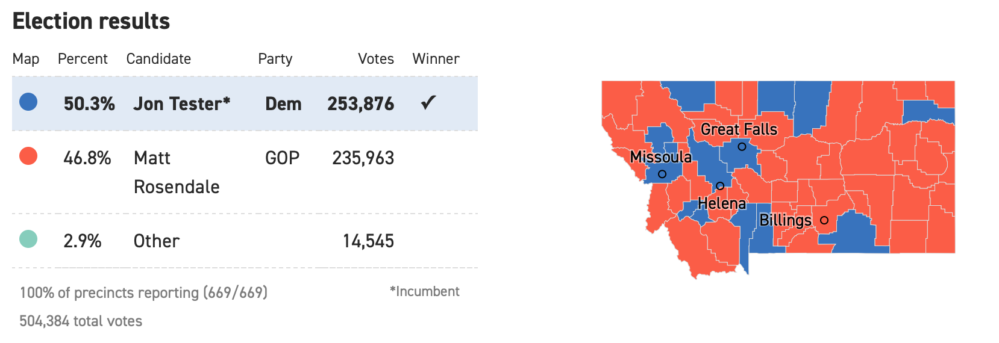

```{r setup, include=FALSE}
knitr::opts_chunk$set(echo = FALSE)
knitr::opts_chunk$set(message = FALSE)
library(dplyr)
library(ggplot2)
library(leaflet)
library(readr)
library(geojsonio)
```

# Class Intro

## Intro Questions 
- We recently wrapped up the section on geostatistical or point-reference data. Assume you have two minutes with a recruiter, explain what you have learned thus far.

- For Today:
    - Areal Data


# Areal Data Overview

## Areal Data

Defining features: random observation measured at well defined subsets, such as a city or state.

```{r, out.width = "95%", echo = F, fig.align = 'center', fig.cap='source: https://www.politico.com/election-results/2018/montana/'}
 
```

## Areal Data 

**Recall:** How can spatial information be incorporated with this data structure?

```{r, out.width = "95%", echo = F, fig.align = 'center', fig.cap='source: https://www.politico.com/election-results/2018/montana/'}
 
```

## Areal Data Model Overview
- Data, typically averages or totals, are captured for geographic units or blocks
- Spatial correlation is incorporated with a *neighbor* structure.
- Autoregressive models on the neighbor structure capture spatial similarities.
- Model based approaches will incorporate covariates and introduce spatial structure with random effects.

## Areal Data Inferential Questions

1. Is there a spatial pattern?
2. In presenting a map of expected responses, should the raw values or a smoothed response be presented?
3. What values would be expected for new set of areal units?


# Exploratory Methods for Areal Data

## Data Viz Options
Creating choropleth maps:

- [Poverty in Nepal with ggplot](https://medium.com/@anjesh/step-by-step-choropleth-map-in-r-a-case-of-mapping-nepal-7f62a84078d9)
- [Plotly](https://plot.ly/r/choropleth-maps/#choropleth-maps-in-r)
- [Crime in Philly](https://cengel.github.io/rspatial/4_Mapping.nb.html)
- [State and County Population](http://www.bargava.com/Intro-to-Choropleth-using-R/)

## Leaflet Tutorial

Follow the [Leaflet tutorial](https://rstudio.github.io/leaflet/choropleths.html) for creating choropleths.

- what is the object `states`?
- based on my drives through South Dakota, I'm convinced there is a data entry error with the density for South Dakota. Fix this.


```{r, eval = F}

library(geojson)
library(geojsonio)
library(leaflet)
url <- "http://leafletjs.com/examples/choropleth/us-states.js"

# read as text file
doc <- readLines(url)

# remove the javascript assignment at the front 
doc2 <- gsub("var statesData = ", "", doc)

# write out as a temp file and read
write(doc2, file = "tempgeo.json")
states <- geojson_read("tempgeo.json", what = "sp")
class(states)
names(states)


# basic map
m <- leaflet(states) %>%
  setView(-96, 37.8, 4) %>%
  addProviderTiles("MapBox", options = providerTileOptions(
    id = "mapbox.light",
    accessToken = Sys.getenv('MAPBOX_ACCESS_TOKEN')))
m %>% addPolygons()

# adding color
bins <- c(0, 10, 20, 50, 100, 200, 500, 1000, Inf)
pal <- colorBin("YlOrRd", domain = states$density, bins = bins)

m %>% addPolygons(
  fillColor = ~pal(density),
  weight = 2,
  opacity = 1,
  color = "white",
  dashArray = "3",
  fillOpacity = 0.7)

## interaction

m %>% addPolygons(
  fillColor = ~pal(density),
  weight = 2,
  opacity = 1,
  color = "white",
  dashArray = "3",
  fillOpacity = 0.7,
  highlight = highlightOptions(
    weight = 5,
    color = "#666",
    dashArray = "",
    fillOpacity = 0.7,
    bringToFront = TRUE))

## Labels

labels <- sprintf(
  "<strong>%s</strong><br/>%g people / mi<sup>2</sup>",
  states$name, states$density
) %>% lapply(htmltools::HTML)

m <- m %>% addPolygons(
  fillColor = ~pal(density),
  weight = 2,
  opacity = 1,
  color = "white",
  dashArray = "3",
  fillOpacity = 0.7,
  highlight = highlightOptions(
    weight = 5,
    color = "#666",
    dashArray = "",
    fillOpacity = 0.7,
    bringToFront = TRUE),
  label = labels,
  labelOptions = labelOptions(
    style = list("font-weight" = "normal", padding = "3px 8px"),
    textsize = "15px",
    direction = "auto"))
m

## Legend

m %>% addLegend(pal = pal, values = ~density, opacity = 0.7, title = NULL,
  position = "bottomright")
```

## Choropleth Tutorial # 2
- What are the objects `urbnmapr::states` and `urbnmapr::counties`?
- What is `urbnmapr::countydata`?
- Why do you think there only 6 colors for the state?

```{r, echo = F, eval = F}
#devtools::install_github("UrbanInstitute/urbnmapr")
library(urbnmapr)
library(ggplot2)

ggplot() + 
  geom_polygon(data = urbnmapr::states, mapping = aes(x = long, y = lat, group = group), fill = "grey", color = "white") +
  coord_map(projection = "mercator")

ggplot() + 
  geom_polygon(data = urbnmapr::counties, mapping = aes(x = long, y = lat, group = group), fill = "grey", color = "white") +
  coord_map(projection = "mercator")

## Merge Data
household_data <- left_join(countydata, counties, by = "county_fips") 

household_data %>%
  ggplot(aes(long, lat, group = group, fill = medhhincome)) +
  geom_polygon(color = NA) +
  coord_map(projection = "albers", lat0 = 39, lat1 = 45) +
  labs(fill = "Median Household Income")

## Montana Only

# rainbow colors for Eli - not recommended
countydata %>% 
  left_join(counties, by = "county_fips") %>% 
  filter(state_name =="Montana") %>% 
  ggplot(mapping = aes(long, lat, group = group, fill = horate)) +
  geom_polygon(color = "#ffffff", size = .25) +
  coord_map(projection = "albers", lat0 = 39, lat1 = 45) +
  theme(legend.title = element_text(),
        legend.key.width = unit(.5, "in")) +
  labs(fill = "Homeownership rate") +
  scale_fill_gradientn(labels = scales::percent, guide = guide_colorbar(title.position = "top"),colours = rainbow(10)) 
```

## Choropleth Tutorial # 3

- Now download the election results and create two maps by county.
1. Total number of votes for Tester
2. Proportion of votes for Tester

```{r, eval = F}
library(readr)
read_csv('Tester_Results.csv')
```

# Exploratory Approaches for Areal Data

## Proximity Matrix
- Similar to the distance matrix with point-reference data, a proximity matrix $W$ is used to model areal data.
- Given measurements $Y_i, \dots, Y_n$ associated with areal units $1, \dots, n$, the elements of $W$, $w_{ij}$ connect units $i$ and $j$
- Common values for $w_{ij}$ are
$$w_{ij} =\begin{cases} 1 & \text{if i and j are adjacent} \\ 
0& \mbox{otherwise (or if i=j) } 
\end{cases}$$

## Grid Example
- Create an adjacency matrix with diagonal neigbors
- Create an adjacency matrix without diagonal neigbors
```{r, echo = F}
d=data.frame(xmin=c(0.5,0.5,0.5,-.5,-.5,-.5,-1.5,-1.5,-1.5),
             xmax=c(1.5,1.5,1.5,.5,.5,.5,-.5,-.5,-.5),
             ymin=rep(c(.5,-.5,-1.5), 3), 
             ymax=rep(c(1.5,.5,-.5), 3),
             id=c(1,2,3,4,5,6,7,8,9))
ggplot() + 
  scale_x_continuous(name="x") + 
  scale_y_continuous(name="y") +
  geom_rect(data=d, mapping=aes(xmin=xmin, xmax=xmax, ymin=ymin, ymax=ymax), color="black", alpha=0.5) +
  geom_text(data=d, aes(x=xmin+(xmax-xmin)/2, y=ymin+(ymax-ymin)/2, label=id), size=4) 

```

## Spatial Association

There are two common statistics used for assessing spatial association:
Moran's I and Geary's C.

- Moran's I
$$I =\frac{n \sum_i \sum_j w_{ij} (Y_i - \bar{Y})(Y_j -\bar{Y})}{(\sum_{i\neq j \;w_{ij}})\sum_i(Y_i - \bar{Y})^2}$$
- Geary's C
$$C=\frac{(n-1)\sum_i \sum_j w_{ij}(Y_i-Y_j)^2}{2(\sum_{i \neq j \; w_{ij}})\sum_i (Y_i - \bar{Y})^2}$$